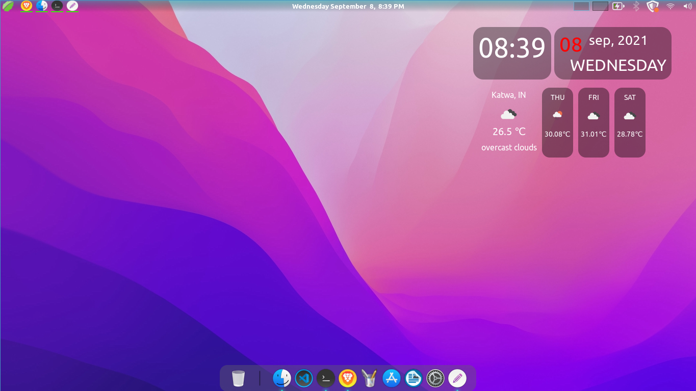

# customize your linux-mint with tirtha


### step 1 - Install waterbody theme 
> install waterbody theme from linux mint theme downloader or visit <a href="https://cinnamon-spices.linuxmint.com/themes/view/waterbody">cinnamon-spice's</a> site.<br>

### step 2 - apply new icon pack
> get the [Tela-circle-ubuntu] icon pack in ```icon-pack``` folder in this repository and paste it in  ```~/.icons``` directory of your local mechine .<br>
> then open the themes and select Tela-circle-ubuntu 

### step 3 -Install clocket desklet

> way 1 - install clocket desklet from linux mint desklet downloader (Reccomended)<br>
> way 2 - install clocket from <a href="https://cinnamon-spices.linuxmint.com/desklets/view/59">cinnamon-spice</a> <br>
> way 3 - install clocket from <a href="https://github.com/tirtharajsinha/clocket">developer's repository</a>. (if you want most recent version then reccomended.)

### step 4 - get dock::plank 
> install plank dock using command ``` sudo apt install plank ```.

### step 5 - apply mac os monatery dock theme 

> get the mcOS-Monterey-Dark theme in dock-theme folder in this repository and paste it in  ```~/.local/share/plank/themes``` .

### step 6 - set your fav wallpaper .
> this is on you. so choose some eye catching wallpaper for your newly customized linux-mint.
> recommendation : mac os monetory wallpaper is my personal favourite.


### after everything setup should look like this >>>>>


